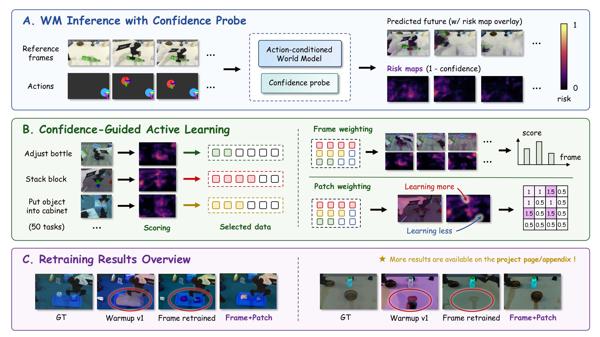

# ConfAL-WM: Confidence-Guided Active Learning for Action-Conditioned World Models



**[🔷 Project Page](https://ConfAL-WM.github.io)** · **[🤗 Checkpoints](https://huggingface.co/anonymous89793/ConfAL-WM)** · **[🤗 Data & Evaluation Artifacts](https://huggingface.co/datasets/anonymous89793/ConfAL-WM-Dataset)**

## Overview

ConfAL-WM is a confidence-guided active learning framework for action-conditioned world models, built on the [EVAC](https://github.com/AgibotTech/EnerVerse-AC) world model. A lightweight probe, trained on frozen UNet decoder features, produces dense per-patch confidence maps over predicted future frames, and these confidence maps drive a complete active post-training loop on the RoboTwin 2.0 simulation dataset:

1. **Score** — run the confidence probe over a candidate pool to obtain dense risk maps and per-episode risk metrics.
2. **Select** — prescreen representative scenes per task, then allocate per-task data budgets by risk (mean / tail / persistent risk).
3. **Retrain** — fine-tune the world model with confidence-guided frame + residual-patch loss weighting.

The same confidence signal is reused for evaluation and visualization: confidence heatmaps, risk maps, and oracle-error comparisons over predicted rollouts.

### ✅ Released checkpoints

| Checkpoint | Description | Link |
|------------|-------------|------|
| EVAC · Warmup v1 | RoboTwin2.0-adapted warmup model (selection baseline) | [EVAC warmup v1.ckpt](https://huggingface.co/anonymous89793/ConfAL-WM/blob/main/EVAC%20warmup%20v1.ckpt) |
| EVAC-v2 · Weighting none | Mean-risk selection-only checkpoint | [EVAC-v2 weighting none.ckpt](https://huggingface.co/anonymous89793/ConfAL-WM/blob/main/EVAC-v2%20weighting%20none.ckpt) |
| EVAC-v2 · Frame | Confidence-guided frame weighting | [EVAC-v2 weighting frame.ckpt](https://huggingface.co/anonymous89793/ConfAL-WM/blob/main/EVAC-v2%20weighting%20frame.ckpt) |
| EVAC-v2 · Frame + Patch | Dense confidence-guided retraining (main model) | [EVAC-v2 weighting frame+patch.ckpt](https://huggingface.co/anonymous89793/ConfAL-WM/blob/main/EVAC-v2%20weighting%20frame%2Bpatch.ckpt) |
| Confidence probe · RoboTwin2.0 | Main probe used in the paper | [Confidence probe RoboTwin2.0.pt](https://huggingface.co/anonymous89793/ConfAL-WM/blob/main/Confidence%20probe%20RoboTwin2.0.pt) |
| Confidence probe · AgiBotWorld | Additional probe checkpoint | [Confidence probe AgiBotWorld.pt](https://huggingface.co/anonymous89793/ConfAL-WM/blob/main/Confidence%20probe%20AgiBotWorld.pt) |
| YOLO · RoboTwin2.0 | Gripper detector for trajectory metrics | [YOLO RoboTwin2.0.pt](https://huggingface.co/anonymous89793/ConfAL-WM/blob/main/YOLO%20RoboTwin2.0.pt) |

### ✅ Released data & evaluation artifacts

Precomputed artifacts that skip the most expensive inference stages (all in [ConfAL-WM-Dataset](https://huggingface.co/datasets/anonymous89793/ConfAL-WM-Dataset)):

| Artifact | Contents |
|----------|----------|
| [50-task prescreen package](https://huggingface.co/datasets/anonymous89793/ConfAL-WM-Dataset/tree/main/50-task%20prescreen%20package) | EVAC-v1 inference, confidence scores, risk maps, JSON metadata |
| [EVAC-v2 training · inference](https://huggingface.co/datasets/anonymous89793/ConfAL-WM-Dataset/tree/main/EVAC-v2%20training%20-%20inference) | Precomputed v1 inference outputs + episode metadata |
| [EVAC-v2 training · dense confidence](https://huggingface.co/datasets/anonymous89793/ConfAL-WM-Dataset/tree/main/EVAC-v2%20training%20-%20dense%20confidence) | Dense confidence/risk outputs for confidence-guided retraining |
| [Baseline selection · v1 inference](https://huggingface.co/datasets/anonymous89793/ConfAL-WM-Dataset/tree/main/Baseline%20selection%20-%20v1%20inference%20results) | v1 inference outputs for baseline-selected tasks/scenes |
| [Baseline weighting · v2 frame-scoring](https://huggingface.co/datasets/anonymous89793/ConfAL-WM-Dataset/tree/main/Baseline%20weighting%20-%20v2%20frame-scoring%20data) | Frame-level scoring artifacts for the additional-weighting baselines |
| [YOLO RoboTwin2.0 annotations](https://huggingface.co/datasets/anonymous89793/ConfAL-WM-Dataset/tree/main/YOLO%20RoboTwin2.0%20annotations) | Gripper trajectory labels + manifests |
| [Evaluation tables & bootstrap JSON](https://huggingface.co/datasets/anonymous89793/ConfAL-WM-Dataset/tree/main/Evaluation%20tables%20and%20bootstrap%20JSON) | Mean / per-seed metrics and paired-bootstrap statistics |

## 🔧 Setup

```bash
conda create -n enerverse python=3.10.4
conda activate enerverse
pip install -r requirements.txt

# PyTorch3D (CUDA 12.1 prebuilt)
pip install --no-index --no-cache-dir pytorch3d \
  -f https://dl.fbaipublicfiles.com/pytorch3d/packaging/wheels/py310_cu121_pyt240/download.html
```

**Required base checkpoints** (place under `checkpoints/`):

| File | Source | Destination |
|------|--------|-------------|
| `EnerV_AC_deepspeed_v0.1.pt` | [EVAC / EnerVerse-AC](https://huggingface.co/agibot-world/EnerVerse-AC) | `checkpoints/EVAC/` |
| `open_clip_pytorch_model.bin` | [CLIP ViT-H-14](https://huggingface.co/laion/CLIP-ViT-H-14-laion2B-s32B-b79K) | `checkpoints/CLIP/` |

### RoboTwin 2.0 dataset

The pre-collected RoboTwin 2.0 data is hosted on Hugging Face:
[RoboTwin 2.0 dataset](https://huggingface.co/datasets/TianxingChen/RoboTwin2.0/tree/main/dataset).
We use the **`aloha-agilex_randomized_500`** variant — domain-randomized expert
demonstrations on the Aloha-AgileX dual-arm embodiment (500 trajectories per task;
the alternative `aloha-agilex_clean_50` configuration is not used by this pipeline).

Each task ships as its own zip: `dataset/{task_name}/aloha-agilex_randomized_500.zip`
(individual zips are ~4 GB; the full collection is ~1.4 TB, so download only the
tasks you need). Unzip them under `datasets/RoboTwin2.0/dataset/` so the converter's
`--raw_root` points at the per-task folders. See the
[official RoboTwin installation docs](https://robotwin-platform.github.io/doc/usage/robotwin-install.html)
for details.

---

## 🎯 Active Learning Pipeline (RoboTwin 2.0)

All steps are configured through `configs/agibotworld/al_robotwin.yaml`. The method tuple `--score_method c3 --select_method <method> --weighting <mode>` must stay consistent across selection, scoring, finalization, retraining, and evaluation so output paths remain comparable.

```bash
# Step 0: Convert RoboTwin 2.0 data (one-time)
python al_pipeline/external_datasets/robotwin_converter.py \
  --raw_root datasets/RoboTwin2.0/dataset \
  --converted_root datasets/RoboTwin2.0/aloha-agilex_rand_500 \
  --robot aloha-agilex --variant randomized_500 --min_frames 4 --workers 32

# Step 1: Build external AL splits (c3_train / candidate_pool / val)
python al_pipeline/build_external_al_splits.py \
  --config configs/agibotworld/al_robotwin.yaml

# Step 2: Train the C3 confidence probe on RoboTwin
torchrun --nproc_per_node=2 --master_port=29504 \
  trainer/train_c3_probe.py \
  --config configs/agibotworld/train_c3_probe.yaml \
  --index al_runs/robotwin_al/manifests/c3_train_split.json \
  --data_format external_worldmodel \
  --output_dir logs/c3_robotwin_external \
  --feat_mode dec_only --probe_block_idx 5 \
  --target_space latent --threshold_mode ema_warmup \
  --max_steps 8000 --bf16 --batch_size 16 --lr 2e-3 \
  --device 0,1
# Then point model/scoring c3_probe_checkpoint in the config at the trained probe,
# or skip this step by downloading the released "Confidence probe RoboTwin2.0.pt".

# Step 3: Warm up EVAC v1 on the C3 train split (plain fine-tuning, no weighting)
python trainer/train_evac_with_al.py \
  --config configs/agibotworld/al_robotwin.yaml \
  --stage warmup --weighting none \
  --launch --gpus 0,1
# Afterwards fill model.evac_v1_checkpoint with the produced checkpoint
# (or download the released "EVAC warmup v1.ckpt" and set it directly).

# Step 4: Task-level prescreen — build representatives and score them with EVAC v1 + C3
python al_pipeline/selection.py build \
  --config configs/agibotworld/al_robotwin.yaml

python al_pipeline/score_pool.py \
  --config configs/agibotworld/al_robotwin.yaml \
  --score_method c3 \
  --num_shards 2 --workers_per_gpu 5 --gpus 0,1

# Step 5: Allocate per-task budgets, select candidates, and detailed-score the selection
python al_pipeline/selection.py select \
  --config configs/agibotworld/al_robotwin.yaml \
  --score_method c3 --select_method mean_risk

python al_pipeline/score_pool.py \
  --config configs/agibotworld/al_robotwin.yaml \
  --score_method c3 --select_method mean_risk \
  --num_shards 2 --workers_per_gpu 5 --gpus 0,1
# Detailed scores are only needed for --weighting frame / frame_patch.

# Step 6: Finalize selected.json and retrain EVAC v2 with confidence weighting
python al_pipeline/selection.py finalize \
  --config configs/agibotworld/al_robotwin.yaml \
  --score_method c3 --select_method mean_risk --weighting frame_patch

python trainer/train_evac_with_al.py \
  --config configs/agibotworld/al_robotwin.yaml \
  --stage selected --score_method c3 --select_method mean_risk --weighting frame_patch \
  --launch --gpus 0,1
# Optional: --patch_frame_hyp 0.5 overrides the frame+patch alpha;
# --include_c3_train_split adds the warmup split back (anti-forgetting replay);
# --save_every saves periodic checkpoints (from ~75% of training on), which can
# be evaluated afterwards in one go:
#   python eval/al_results/eval_periodic_checkpoints.py \
#     --run-dir al_runs/robotwin_al/retrain/c3_mean_risk_frame_patch \
#     --config configs/agibotworld/al_robotwin.yaml --gpus 0,1
```

Already-scored episodes are always skipped; add `--overwrite` to regenerate. Frame counts default to auto (`min(action frames, GT frames) - n_previous`); pass `--n-frames N` to force a fixed length.

### Multi-GPU scaling

`max_steps` is auto-scaled by GPU count to keep total training volume constant (2-GPU baseline, base `max_steps: 4000` in the `retraining` config section):

| GPUs | Effective batch | max_steps | ~Wall time |
|------|-----------------|-----------|------------|
| 1 | 8 | 8000 | ~24h |
| 2 | 16 | 4000 | ~12h |
| 4 | 32 | 2000 | ~6h |

When launching several jobs at once, give each a different `--gpus`; the launcher picks `master_port = 29500 + first_gpu_id` and advances to a free port if busy (`--master_port` overrides).

### Selection methods

| Method | Key | Description |
|--------|-----|-------------|
| Mean risk | `mean_risk` | Allocate more budget to tasks with higher representative mean risk |
| Tail risk | `tail_risk` | Allocate by `tail_risk_top5` (top-5% patch risk) |
| Persistent risk | `persistent_risk` | Allocate to tasks with sustained high-risk regions |

### Weighting modes

| Mode | Config value | Behavior |
|------|-------------|----------|
| **Frame + residual patch** | `frame_patch` | Default: `frame_mean(conf) + alpha * (conf - frame_mean(conf))`, alpha via `--patch_frame_hyp` (default `0.5`) |
| **Frame** | `frame` | Per-frame loss weights from the spatially-averaged confidence map |

> **Scoring baselines.** The pipeline also supports reward/progress/preference/judge-based scoring baselines (RoboReward, GVL, Robometer, LRMs, PRM-as-a-Judge) as drop-in `--score_method` replacements through `baselines/evac_al_baselines/`. Their setup is optional — see the collapsible [Scoring baselines](#scoring-baselines-optional) section below.

---

## 📊 Evaluation

Two stages: run inference with a retrained checkpoint on val episodes, then compute metrics against GT.

```bash
# 1. EVAC inference on val episodes (output: {retrain_dir}/val_infer)
python eval/al_results/run_val_inference.py \
  --checkpoint al_runs/robotwin_al/retrain/c3_mean_risk_frame_patch/logs/checkpoints/epoch=*-step=*.ckpt \
  --config configs/agibotworld/al_robotwin.yaml \
  --manifest al_runs/robotwin_al/manifests/al_val.json \
  --num_shards 2 --workers_per_gpu 4 --gpus 0,1 \
  --export_compare 3

# 2. Compute metrics (output: al_runs/robotwin_al/eval/c3_mean_risk_frame_patch.json)
python eval/al_results/evaluate_al_round.py \
  --checkpoint al_runs/robotwin_al/retrain/c3_mean_risk_frame_patch/logs/checkpoints/epoch=*-step=*.ckpt \
  --score_method c3 --select_method mean_risk --weighting frame_patch \
  --val-manifest al_runs/robotwin_al/manifests/al_val.json \
  --pred-dir al_runs/robotwin_al/retrain/c3_mean_risk_frame_patch/val_infer \
  --metrics pixel_mae,latent_loss,risk_reduction,ewmbench \
  --use_ewmbench_evaluate_py
```

`run_val_inference.py` is resume-safe and saves `latent_pred.npy` / `latent_gt.npy` for the latent metric. `--ewmbench-gpus N` pins EWMBench to one GPU when running several evals in parallel.

### Metrics

| Flag | Description | Requires |
|------|-------------|----------|
| `pixel_mae` | Mean/median/CVaR of per-frame pixel MAE (primary) | pred frames + GT frames |
| `latent_loss` | MSE between predicted and GT latent features | `latent_pred.npy` + `latent_gt.npy` |
| `risk_reduction` | CVaR of composite (latent + pixel) episode-level error | `pixel_mae` and/or `latent_loss` |
| `ewmbench` | External [EWMBench](https://github.com/AgibotTech/EWMBench) metrics via a format adapter | EWMBench repo + conda env |

Each eval JSON also contains compact bootstrap intervals: `self_bootstrap_0.95CI` (marginal CI of the method's own mean) and `paired_bootstrap_delta_0.95CI` (paired bootstrap against `warmup_none.json`; positive = better than Warmup v1).

### EWMBench setup

The `ewmbench` metric calls the official EWMBench evaluator from a separate conda environment; the adapter only creates a temporary EWMBench-compatible data tree and never modifies the EWMBench repo. See the [EWMBench repository](https://github.com/AgibotTech/EWMBench) for the metric definitions (pixel fidelity, scene consistency, trajectory consistency, semantics, diversity).

```bash
git clone https://github.com/AgibotTech/EWMBench.git third_party/EWMBench

conda create -n EWMBench python=3.10 -y
conda activate EWMBench
pip install -r third_party/EWMBench/requirements.txt
pip install git+https://github.com/openai/CLIP.git
```

Then set the repo path and env python in `configs/agibotworld/al_robotwin.yaml`:

```yaml
ewmbench:
  repo: third_party/EWMBench
  python: /absolute/path/to/envs/EWMBench/bin/python
```

`trajectory_consistency` additionally needs the RoboTwin-aware gripper detector — use the released [YOLO RoboTwin2.0.pt](https://huggingface.co/anonymous89793/ConfAL-WM/blob/main/YOLO%20RoboTwin2.0.pt) weight (see below); the AgiBot-tuned EWMBench YOLO checkpoint does not reliably detect RoboTwin grippers.

---

## 🖼️ Visualization

`visualize_val_results.py` renders per-episode GT/prediction sheets, trajectory-condition overlays, and C3 confidence / risk heatmaps from any prediction directory produced by `run_val_inference.py` or `score_pool.py`:

```bash
python eval/al_results/visualize_val_results.py \
  --pred-dir al_runs/robotwin_al/retrain/c3_mean_risk_frame_patch/val_infer \
  --manifest al_runs/robotwin_al/manifests/al_val.json \
  --config configs/agibotworld/al_robotwin.yaml \
  --max-episodes 3 \
  --vis-traj \
  --save_conf_map
  # --save_conf_video additionally writes confidence_heatmap.mp4 / confidence_overlay.mp4
```

Output goes to `{pred_dir}_visualize/{episode_id}/`. With `--save_conf_map`, each episode gets confidence contact sheets (pixel space and, when latent files exist, latent space) pairing GT frames, predictions, oracle error, the confidence heatmap, and the risk map (`1 - confidence`) overlay.

> **Trajectory geometry.** EVAC's default trajectory renderer uses an AgiBot gripper offset (`traj_gripper_z_offset=0.23`). For RoboTwin/Aloha the config sets `traj_gripper_z_offset: 0.0` under `retraining.traj_conditioning`; keep these values consistent between scoring, retraining, and inference so rendered trajectories align with the robot.

---

## 🤖 RoboTwin gripper YOLO detector

EWMBench `trajectory_consistency` requires a gripper detector to produce `traj/traj.npy`. A RoboTwin2.0-finetuned YOLO detector is released: [YOLO RoboTwin2.0.pt](https://huggingface.co/anonymous89793/ConfAL-WM/blob/main/YOLO%20RoboTwin2.0.pt) (point `ewmbench.ckpt.yolo_world_ckpt` at it). To retrain or adapt it on your own subset (pseudo-labels are projected from action conditions):

```bash
python eval/retrain_yolo/prepare_robotwin_yolo_dataset.py \
  --config configs/agibotworld/al_robotwin.yaml \
  --output_dir eval/retrain_yolo/robotwin_gripper_yolo \
  --frame_stride 10 --workers 16 --overwrite

python eval/retrain_yolo/train_yolo_robotwin.py \
  --dataset_dir eval/retrain_yolo/robotwin_gripper_yolo \
  --base_model <yolo_base_weight.pt> \
  --epochs 5 --imgsz 640 --batch 256 --workers 16 --cache disk --gpus 0,1
```

See `eval/retrain_yolo/README.md` for details.

---

## Scoring baselines (optional)

<details>
<summary><b>Click to expand: scoring baselines — setup, servers, and references</b></summary>

External scoring baselines (reward / progress / preference / judge models) compare against C3 confidence as acquisition signals. They all write the same AL contract as C3 (`scored_pool.json` with risk metrics filled from the GT-vs-pred score gap `risk = max(0, gt_score - pred_score)`) and emit scalar/frame scores only — no dense confidence maps — so they support `--weighting none` / `frame` but not `frame_patch`. Scoring itself always runs from the normal `enerverse` environment; external models live in their own conda envs and are reached over HTTP (or by explicit python path for PRM).

| Method | `score_method` | What it does | Ref |
|--------|----------------|--------------|-----|
| GVL-Qwen | `gvl` | Shuffled-frame task-completion prompting via an OpenAI-compatible VLM API | Ma et al., 2024 |
| Robometer | `robometer_prog` / `robometer_pref` | Trajectory-level progress / preference reward | Liang et al., 2026 |
| RoboReward | `roboreward` | General-purpose VLM reward | Lee et al., 2026 |
| LRM / LRMs | `lrm` / `lrms` | Online robot reward from a VLM reward server | Wu et al., 2026 |
| PRM-as-a-Judge | `prm_judge` | Dense per-step robotic auditing via a GRM | Ji et al., 2026 |
| Random | `random` | Random scores, no EVAC inference (smoke test) | — |

### Running a baseline

Swap `--score_method` for any baseline key; the rest of the pipeline is unchanged:

```bash
# 1) Score task representatives (start the method's server first, see below)
python al_pipeline/score_pool.py \
  --config configs/agibotworld/al_robotwin.yaml \
  --score_method robometer_prog

# 2) Allocate task budgets
python al_pipeline/selection.py select \
  --config configs/agibotworld/al_robotwin.yaml \
  --score_method robometer_prog --select_method mean_risk

# 3) Score the selected candidates with the same baseline
python al_pipeline/score_pool.py \
  --config configs/agibotworld/al_robotwin.yaml \
  --score_method robometer_prog --select_method mean_risk

# 4) Finalize and train without C3 patch maps
python al_pipeline/selection.py finalize \
  --config configs/agibotworld/al_robotwin.yaml \
  --score_method robometer_prog --select_method mean_risk --weighting none

python trainer/train_evac_with_al.py \
  --config configs/agibotworld/al_robotwin.yaml \
  --stage selected --score_method robometer_prog --select_method mean_risk --weighting none \
  --launch --gpus 0,1
```

Use `--baseline-config` to point at a modified `baselines/evac_al_baselines/configs/baselines.yaml`. Third-party baseline repos are intentionally git-ignored — clone them manually:

```bash
mkdir -p baselines
git clone https://github.com/robometer/robometer.git baselines/robometer
git clone https://github.com/physical-superintelligence-lab/Large-Reward-Models.git baselines/Large-Reward-Models
git clone https://github.com/Yuheng2000/PRM-as-a-Judge.git baselines/PRM-as-a-Judge
```

### Robometer server

```bash
conda create -n robometer python=3.10 -y
conda activate robometer
cd baselines/robometer
conda install -c conda-forge ffmpeg=7 -y
pip install uv
uv sync

# Download the model checkpoint (one-time)
hf download robometer/Robometer-4B --local-dir checkpoints/robometer/Robometer-4B

# Expose conda FFmpeg libs to torchcodec, then start the server.
# The ConfAL-WM launcher leaves the subrepo unchanged and applies a runtime
# dtype patch so processor outputs follow the checkpoint dtype.
export LD_LIBRARY_PATH=$CONDA_PREFIX/lib:$LD_LIBRARY_PATH
export EVAC_ROBOMETER_VISUAL_DTYPE=bfloat16
uv run python ../evac_al_baselines/servers/robometer_eval_server_dtype_patch.py \
  model_path=checkpoints/robometer/Robometer-4B \
  server_url=0.0.0.0 server_port=8000
```

```yaml
# baselines/evac_al_baselines/configs/baselines.yaml
robometer_server_url: http://localhost:8000
robometer_python: ~/miniconda3/envs/robometer/bin/python
```

### GVL via an OpenAI-compatible VLM API (cloud, no local server)

GVL calls an OpenAI-compatible vision-language endpoint — any provider works (DashScope, a self-hosted vLLM server, etc.):

```yaml
gvl_qwen_base_url: https://dashscope.aliyuncs.com/compatible-mode/v1
gvl_qwen_api_key:            # prefer `export GVL_API_KEY=<key>` over committing a key
gvl_qwen_model_name: qwen-vl-max
```

`--gpus` then only parallelizes EVAC prediction generation; GVL itself uses no local GPUs. If you hit `SSL: CERTIFICATE_VERIFY_FAILED`, install `certifi` in the scoring env — it is a conda OpenSSL CA-bundle issue, not an account problem.

### LRMs / RoboReward server

```bash
conda create -n vlm_reward python=3.10 -y
conda activate vlm_reward
cd baselines/Large-Reward-Models
pip install -r vlm_reward/requirements.txt

# Pick a model (USC-PSI-Lab/LRM-models progress/completion/contrastive,
# teetone/RoboReward-8B, ...), then start the server.
cd vlm_reward
MODEL_PATH=checkpoints/LRM-models/progress GPU_ID=0 PORT=5002 bash start_server.sh
```

```yaml
lrm_server_url: http://localhost:5002
lrm_python: ~/miniconda3/envs/vlm_reward/bin/python
```

`lrm`, `lrms`, and `roboreward` share this HTTP server; switch `MODEL_PATH` to switch methods.

### PRM-as-a-Judge (no server)

PRM runs as a subprocess in its own env. The adapter builds the PRM eval video layout under `baselines/cache/prm_judge` and launches `eval/run_judge.py` with the configured python:

```bash
conda create -n prm_judge python=3.10 -y
conda activate prm_judge
cd baselines/PRM-as-a-Judge
pip install torch torchvision transformers accelerate qwen-vl-utils \
  decord opencv-python-headless pillow tqdm pandas numpy vllm

hf download tanhuajie2001/Robo-Dopamine-GRM-2.0-8B-Preview \
  --local-dir checkpoints/PRM-as-a-Judge/Robo-Dopamine-GRM-2.0-8B-Preview
```

```yaml
methods:
  prm_judge:
    python: ~/miniconda3/envs/prm_judge/bin/python
    prm_path: checkpoints/PRM-as-a-Judge/Robo-Dopamine-GRM-2.0-8B-Preview
```

### References

```bib
@misc{ma2024gvl,
  title={Vision Language Models are In-Context Value Learners},
  author={Ma, Yecheng Jason and Hejna, Joey and Wahid, Ayzaan and Fu, Chuyuan and Shah, Dhruv and Liang, Jacky and Xu, Zhuo and Kirmani, Sean and Xu, Peng and Driess, Danny and Xiao, Ted and Tompson, Jonathan and Bastani, Osbert and Jayaraman, Dinesh and Yu, Wenhao and Zhang, Tingnan and Sadigh, Dorsa and Xia, Fei},
  year={2024},
  eprint={2411.04539},
  archivePrefix={arXiv},
  primaryClass={cs.RO},
  url={https://arxiv.org/abs/2411.04549}
}

@misc{liang2026robometer,
  title={Robometer: Scaling General-Purpose Robotic Reward Models via Trajectory Comparisons},
  author={Liang, Anthony and Korkmaz, Yigit and Zhang, Jiahui and Hwang, Minyoung and Anwar, Abrar and Kaushik, Sidhant and Shah, Aditya and Huang, Alex S. and Zettlemoyer, Luke and Fox, Dieter and Xiang, Yu and Li, Anqi and Bobu, Andreea and Gupta, Abhishek and Tu, Stephen and Biyik, Erdem and Zhang, Jesse},
  year={2026},
  eprint={2603.02115},
  archivePrefix={arXiv},
  primaryClass={cs.RO},
  url={https://arxiv.org/abs/2603.02115}
}

@misc{lee2026roboreward,
  title={RoboReward: General-Purpose Vision-Language Reward Models for Robotics},
  author={Lee, Tony and Wagenmaker, Andrew and Pertsch, Karl and Liang, Percy and Levine, Sergey and Finn, Chelsea},
  year={2026},
  eprint={2601.00675},
  archivePrefix={arXiv},
  primaryClass={cs.RO},
  url={https://arxiv.org/abs/2601.00675}
}

@misc{wu2026lrm,
  title={Large Reward Models: Generalizable Online Robot Reward Generation with Vision-Language Models},
  author={Wu, Yanru and Yuan, Weiduo and Qi, Ang and Guizilini, Vitor and Mao, Jiageng and Wang, Yue},
  year={2026},
  eprint={2603.16065},
  archivePrefix={arXiv},
  primaryClass={cs.RO},
  url={https://arxiv.org/abs/2603.16065}
}

@misc{ji2026prmjudge,
  title={PRM-as-a-Judge: A Dense Evaluation Paradigm for Fine-Grained Robotic Auditing},
  author={Ji, Yuheng and Liu, Yuyang and Tan, Huajie and Huang, Xuchuan and Huang, Fanding and Xu, Yijie and Chi, Cheng and Zhao, Yuting and Lyu, Huaihai and Co, Peterson and Cao, Mingyu and Zhang, Qiongyu and Li, Zhe and Zhou, Enshen and Wang, Pengwei and Wang, Zhongyuan and Zhang, Shanghang and Zheng, Xiaolong},
  year={2026},
  eprint={2603.21669},
  archivePrefix={arXiv},
  primaryClass={cs.RO},
  url={https://arxiv.org/abs/2603.21669}
}
```

</details>

---

## Citation

If you find this work useful, please cite:

```bib
@article{confalwm2026,
  title   = {ConfAL-WM: Confidence-Guided Active Learning for Action-Conditioned World Models},
  author  = {Anonymous Authors},
  journal = {arXiv preprint},
  year    = {2026},
  url     = {https://ConfAL-WM.github.io}
}

@article{jiang2025enerverseac,
  title={EnerVerse-AC: Envisioning Embodied Environments with Action Condition},
  author={Jiang, Yuxin and Chen, Shengcong and Huang, Siyuan and Chen, Liliang and Zhou, Pengfei and Liao, Yue and He, Xindong and Liu, Chiming and Li, Hongsheng and Yao, Maoqing and Ren, Guanghui},
  journal={arXiv preprint arXiv:2505.09723},
  year={2025}
}
```

## License

Code and data are released under [CC BY-NC-SA 4.0](https://creativecommons.org/licenses/by-nc-sa/4.0/).
